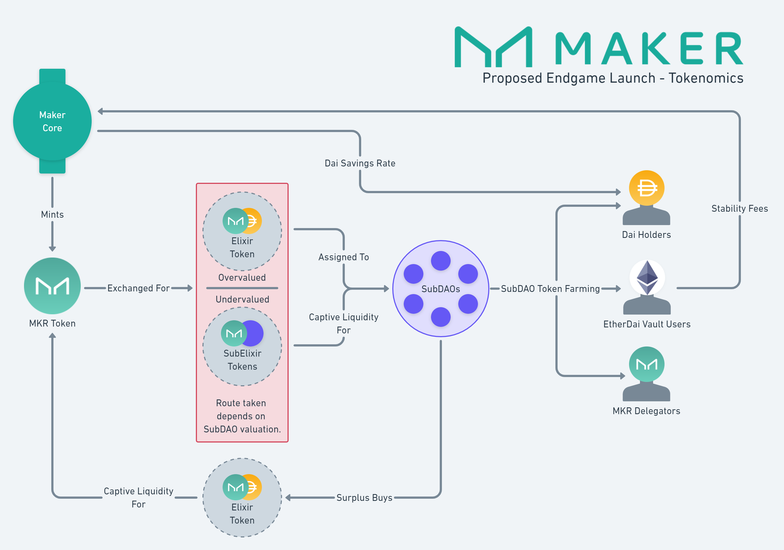

# Endgame Launch Tokenomics

This diagram shows the proposed pre-game implementation of the Endgame Plan tokenomics. It is likely that when the intial version of Endgame is launched, its tokenomics structure will be close to this.


This documentation describes planned functionality and processes that MakerDAO has not yet implemented. Be aware that parts may be inaccurate or out of date.


## Target Launch Tokenomics

## Related Pages
 Elixir 
 SubElixir 

>Page last reviewed: -    
>Next review due: -   