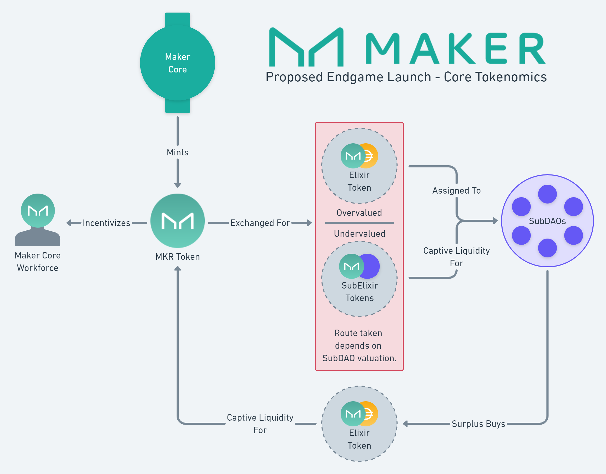

# MKR Tokenomics

MKR (Maker) is the preexisting governance token for the Maker Protocol. Under the Endgame Plan MKR is emitted and burned in various circumstances. 


This documentation describes planned functionality and processes that MakerDAO has not yet implemented. Be aware that parts may be inaccurate or out of date.


## Stated Goals

There are a multiple goals that Maker intends to meet via the new MKR tokenomics.

1. To successfully incubate Maker SubDAOs.
2. To link the value and success of Maker Core with that of its SubDAOs and vice versa.
3. To incentivize talented individuals to work as part of Maker Core.

## Endgame MKR Emissions

Maker Core will emit a total of 60,000 MKR each year which is allocated to benefit its subDAOs. Depending on whether each SubDAO token is undervalued or overvalued, MKR emissions will be used in one of two ways:
* If a SubDAO token is undervalued, Maker Core will accumulate SubElixir. 
* If a SubDAO token is overvalued, Maker Core will accumulate Elixir and transfer it to the SubDAO. 

Each path results in the emitted MKR entering a liquidity pool. In the first case MKR is paired with SubDAO tokens, and in the latter case paired MKR is paired with EtherDai and Dai.

Maker Core will also emit a total of 5,000 MKR each year which it will use to:
* Incubate new SubDAOs
* Provide decentralized workforce bonuses.

## Endgame MKR Burns

The Endgame plan introduces the Maker Burn Engine. The Maker Burn Engine accumulates Elixir using Maker Core protocol surplus. This accumulation of Elixir benefits Dai, EtherDai and MKR liquidity.

The Maker Burn Engine uses its accumulated Elixir to burn MKR when MKR is judged to be undervalued according to a valuation model.

## Launch Overview

## Related Pages
 EtherDai 
 Elixir 
 SubDAOs   

>Page last reviewed: -    
>Next review due: -   