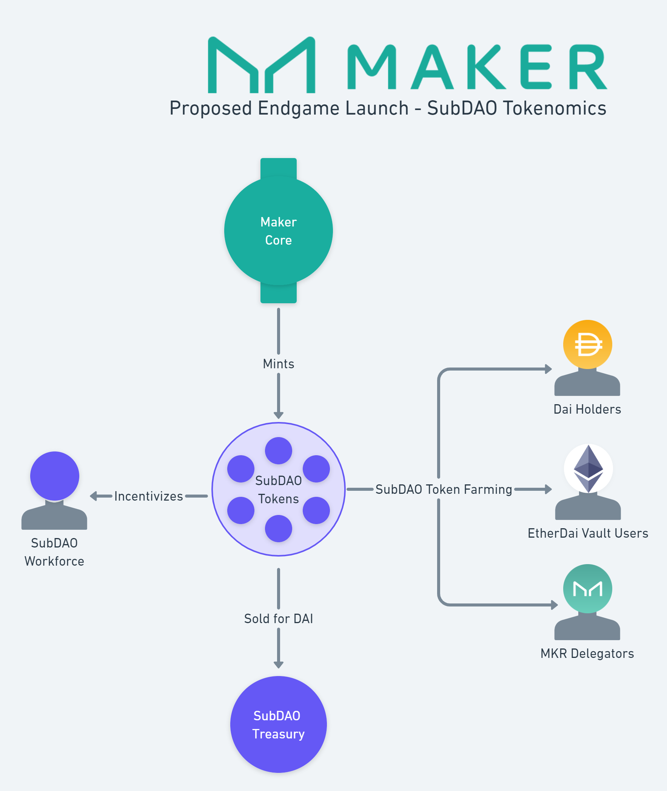

# SubDAO Tokenomics

Each Maker SubDAO has its own SubDAO token. Each SubDAO token is a new token that is minted by Maker Core and distributed widely via token farming initiatives.


This documentation describes planned functionality and processes that MakerDAO has not yet implemented. Be aware that parts may be inaccurate or out of date.


## Stated Goals

There are a multiple goals that Maker intends to meet via the SubDAO tokenomics.

1. To distribute the ownership of each SubDAO as widely as possible.
2. To ensure that SubDAO creation drives value to Maker Core in the form of:
    * Dai demand
    * Stability Fees
    * EtherDai adoption
    * Governance participation
3. To incentivize talented individuals to work to make each SubDAO a success.

## SubDAO Token Emissions

The initial supply of each subDAO token is 2.6 billion. 

400 million SubDAO tokens are set aside to be used as incentives for the SubDAO's workforce.

200 million SubDAO tokens are sold for DAI over a period of 2 years and used to fund the SubDAO treasury.

2 billion of each SubDAO's tokens are used for yield farming during the first 10 years of the SubDAO's lifespan. This is broken down in the table below.

| **Year**    | **Amount Distributed** |
|---------|--------------------|
| Year 1  |        500,000,000 |
| Year 2  |        500,000,000 |
| Year 3  |        250,000,000 |
| Year 4  |        250,000,000 |
| Year 5  |        125,000,000 |
| Year 6  |        125,000,000 |
| Year 7  |         62,500,000 |
| Year 8  |         62,500,000 |
| Year 9  |         62,500,000 |
| Year 10 |         62,500,000 |
| **Total**   |      **2,000,000,000** |

Additionally, each SubDAO emits 3% of their total supply each year. These emissions are directed to the SubDAO's token farms.

## SubDAO Token Farming

20% of the initial SubDAO token distribution is farmable by Dai holders.

40% of the initial SubDAO token distriubtion is farmable by [EtherDai](etherdai.md) vault owners.

40% of the initial SubDAO token distribution is farmable by MKR holders that are active in Maker Core governance.

## SubDAO Token Burn

SubDAOs use locked [Elixir](elixir.md) to burn a small percentage of their governance token each year if the value of their locked Elixir exceeds their token's market cap. This delivers value back to the SubDAO's token holders.

## Launch Overview

>Page last reviewed: 2023-01-30    
>Next review due: 2023-04-30   